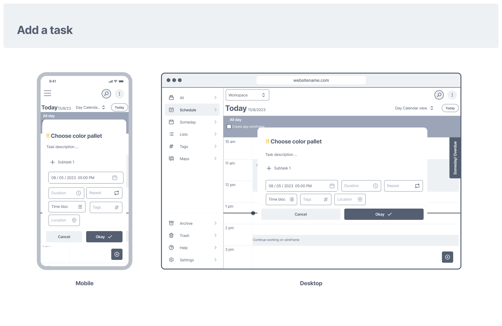
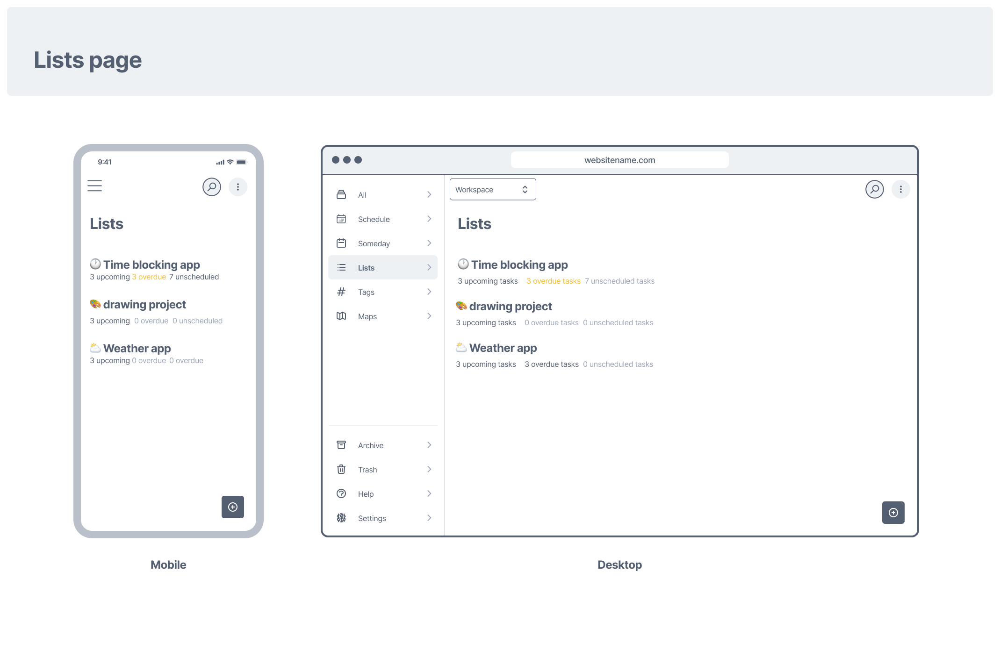

# The time blocking app

**Time blocking app** is made with Flutter,it is a task management tool designed  to help users stay organized and productive for **personal** use. With features inspired by [ClickUp](https://clickup.com/), Apple Reminders, [TickTick](https://ticktick.com/), and [Sorted app](https://www.sortedapp.com/), users can effortlessly create tasks, set due dates, priorities, and categorize tasks using tags. With a user-friendly interface,this app streamlines task management for individuals, ensuring efficient and stress-free workflow.

- Webiste: [https://timeblocking.web.app/](https://timeblocking.web.app/)
- Widgets book: [https://design-timeblocking.web.app/](https://design-timeblocking.web.app/)

| Desktop | Mobile |
|---------|---------|
|| |

------------------------------------------------

# Table of content

- [The time blocking app](#the-time-blocking-app)
- [Table of content](#table-of-content)
  - [Working Process](#working-process)
    - [A) Planning](#a-planning)
      - [1-Opportunity canvas](#1-opportunity-canvas)
      - [2-Evaluating idea using Cynefin framework](#2-evaluating-idea-using-cynefin-framework)
      - [3-Event Storming and User Stories](#3-event-storming-and-user-stories)
      - [Competitors analysis](#competitors-analysis)
      - [=\> Resources and tools used for planning](#-resources-and-tools-used-for-planning)
    - [B) UI/UX Design](#b-uiux-design)
      - [MVP Wireframes](#mvp-wireframes)
        - [Splash screen](#splash-screen)
          - [Authentication screens](#authentication-screens)
          - [Schedule screens](#schedule-screens)
          - [Add a task](#add-a-task)
          - [Lists screens](#lists-screens)
          - [Tags screens](#tags-screens)
          - [Settings screen](#settings-screen)
        - [High fedielty design](#high-fedielty-design)
      - [=\> Resources and tools used for UI/UX design](#-resources-and-tools-used-for-uiux-design)
    - [C) Development](#c-development)
      - [=\> Resources and tools used for Front end Development](#-resources-and-tools-used-for-front-end-development)
      - [=\> Resources and tools used for Backend Development](#-resources-and-tools-used-for-backend-development)
      - [=\> Packages used for Testing](#-packages-used-for-testing)
      - [=\> Resources and tools used for Deployment and Hosting](#-resources-and-tools-used-for-deployment-and-hosting)
      - [=\> Other Resources and tools used for](#-other-resources-and-tools-used-for)

## Working Process

### A) Planning

When planning for this project,I followed [idea to MVP Series](https://www.youtube.com/playlist?list=PL-h45vtEf6cpCoathyiJnF3ry_aihWe-P) by [Essam Cafe](https://www.youtube.com/@essamcafe) and created this [Miro board](https://miro.com/app/board/uXjVPjEXOcw=/) *though the series is more about making a product as a team not solo,I still found it useful*

#### 1-Opportunity canvas

> An opportunity canvas is a one-pager that helps you think through the problem you're solving, the solution you're proposing, and the impact it will have on your users and your business. It's a great tool for validating ideas and ensuring that you're building the right thing.
>
>It has four key areas:
><ul>
><li>Problem: What problem are you solving for your users?</li>
><li>Solution: What is your proposed solution to the problem?</li>
><li>Impact: What impact will your solution have on your users and your business?</li>
><li>Metrics: How will you measure the success of your solution?</li>
></ul>

Opportunity canvas

#### 2-Evaluating idea using Cynefin framework

Cynefin framework explanation

.png?alt=media)

Cynefin framework

#### 3-Event Storming and User Stories

Features,User stories, Tasks and Spikes are inside github as issues, [The time blocking app overview](https://github.com/laila-nabil/thetimeblockingapp/issues/29) includes all of them ordered

#### Competitors analysis

|                                             | **Time blocking app** | **Sorted**          | **Apple Reminder**                                | **Fantastical** | **Clickup**                                                  |
|---------------------------------------------|-----------------------|---------------------|---------------------------------------------------|-----------------|--------------------------------------------------------------|
| **For personal use**                        | Yes                   | Yes                 | Yes                                               |                 | too Complicated for personal use and the app is to cluttered |
| **task and events are handled differently** | No                    | Yes                 | only tasks are available                          | Yes             | No                                                           |
| **Available for Web**                       | Web only              | iPhone and Mac only | iPhone and Mac and web only (with iCloud account) |                 | Desktop, iPhone and Android                                  |
| Pricing                                     | Free                  | Free and Paid       | Free                                              | Paid            | Free and Paid                                                |

#### => Resources and tools used for planning

- **Guide**: idea to MVP Series by [Essam Cafe](https://www.youtube.com/@essamcafe)
- **Visual Planning**: [miro.com](miro.com)
- Chatgpt

### B) UI/UX Design

#### MVP Wireframes

##### Splash screen

Splash screen

###### Authentication screens

Only clickup

.png)

Anything but clickup  APIs

sign_in.png)
sign_up.png)

Clickup with other backend

sign_up.png)
sign_in.png)
connect1.png)

###### Schedule screens

Schedule screens

###### Add a task

Add a task

###### Lists screens

Lists

###### Tags screens

Tags

###### Settings screen

Settings screen

##### High fedielty design

#### => Resources and tools used for UI/UX design

- **Design** : Figma
- **Design system** : [Rayna ui design system](https://www.raynaui.com/)
- **Generate icon data** : Flutter-icons.com and iconly

### C) Development

#### => Resources and tools used for Front end Development

- **Framework**: Flutter/Dart
- **State** Management: Bloc

#### => Resources and tools used for Backend Development

- **Clickup** Public API
- **Render** as proxy server since Clickup APIs has CORS

#### => Packages used for Testing

- [Test](https://pub.dev/packages/test)
- [Flutter test](https://api.flutter.dev/flutter/flutter_test/flutter_test-library.html)
- [Mochito](https://pub.dev/packages/mockito)
- [Golden toolkit](https://pub.dev/packages/golden_toolkit)

#### => Resources and tools used for Deployment and Hosting

- **Hosting**: Firebase for website

#### => Other Resources and tools used for

- **Project Management**: Github issues with <https://zube.io/>