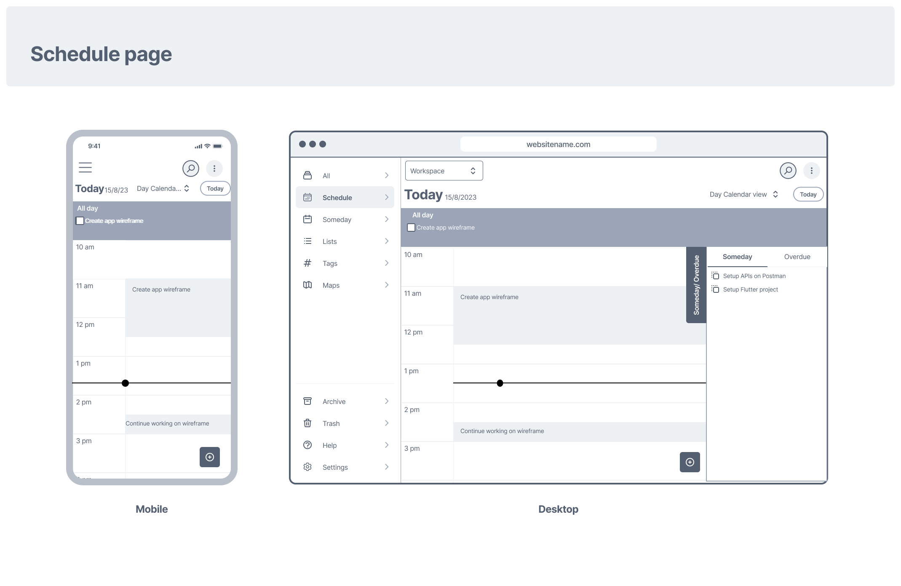
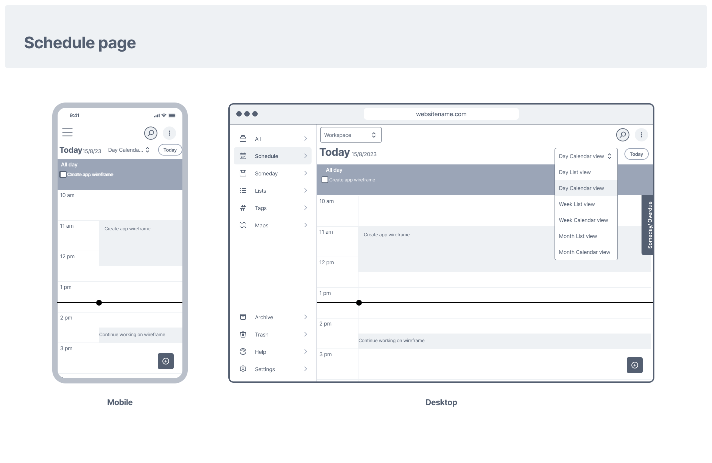
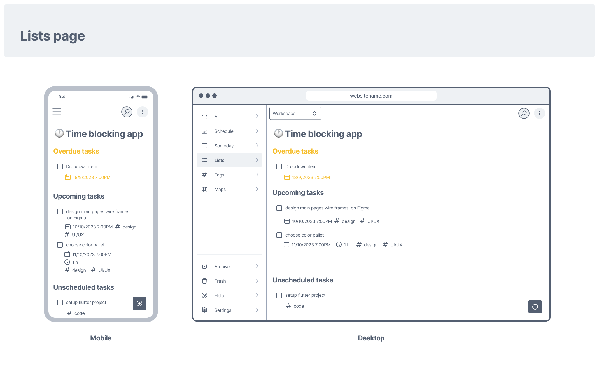

# The time blocking app

**Time blocking app** is made with Flutter,it is a task management tool designed  to help users stay organized and productive for **personal** use. With features inspired by [ClickUp](https://clickup.com/), Apple Reminders, [TickTick](https://ticktick.com/), and [Sorted app](https://www.sortedapp.com/), users can effortlessly create tasks, set due dates, priorities, and categorize tasks using tags. With a user-friendly interface,this app streamlines task management for individuals, ensuring efficient and stress-free workflow.

- Webiste: [https://timeblocking.web.app/](https://timeblocking.web.app/)
- Widgets book: [https://design-timeblocking.web.app/](https://design-timeblocking.web.app/)

| Desktop | Mobile |
|---------|---------|
|| |

------------------------------------------------

# Table of content

- [The time blocking app](#the-time-blocking-app)
- [Table of content](#table-of-content)
  - [Key Features](#key-features)
    - [TODO Features](#todo-features)
  - [Working Process](#working-process)
    - [A) Planning](#a-planning)
      - [1-Opportunity canvas](#1-opportunity-canvas)
      - [2-Evaluating idea using Cynefin framework](#2-evaluating-idea-using-cynefin-framework)
      - [3-Event Storming and User Stories](#3-event-storming-and-user-stories)
      - [Competitors analysis](#competitors-analysis)
      - [=\> Resources and tools used for planning](#-resources-and-tools-used-for-planning)
    - [B) UI/UX Design](#b-uiux-design)
      - [MVP Wireframes](#mvp-wireframes)
      - [High fedielty design](#high-fedielty-design)
      - [=\> Resources and tools used for UI/UX design](#-resources-and-tools-used-for-uiux-design)
    - [C) Development](#c-development)
      - [Architecture](#architecture)
      - [Resources and tools used](#resources-and-tools-used)
        - [for Front end Development](#for-front-end-development)
        - [for Backend Development](#for-backend-development)
        - [for Testing](#for-testing)
        - [for Deployment and Hosting](#for-deployment-and-hosting)
        - [Others](#others)

## Key Features

- Task creation using time blocking method as the calendar is the main view
  - You can create tasks with start date and due date ,add tags to tasks, set task status and set task priority
  - task are inside lists and folders
- Different but simple views
  - Calendar view in schedule page
  - view tasks in single list
  - view tasks that are tagged with a specific tag
- Available for web to access from any device [www.timeblocking.web.app](www.timeblocking.web.app)
  
### TODO Features

- Error handling
- Recurring task
- Duplicate tasks
- Add attachments to tasks
- Subtasks
- Checklists
- Markdown description
- Add location to task
- Map view of tasks
- Voice input of tasks
- Create tasks with email
- Tasks manager
- Auto scheduler
- Trash page
- Smart complete creating task with shortcuts to select list ,tags, priority and status
- Key shortcuts
- Copy list of tasks as text
- Settings page

## Working Process

### A) Planning

When planning for this project,I followed [idea to MVP Series](https://www.youtube.com/playlist?list=PL-h45vtEf6cpCoathyiJnF3ry_aihWe-P) by [Essam Cafe](https://www.youtube.com/@essamcafe) and created this [Miro board](https://miro.com/app/board/uXjVPjEXOcw=/) *though the series is more about making a product as a team not solo,I still found it useful*

#### 1-Opportunity canvas

> An opportunity canvas is a one-pager that helps you think through the problem you're solving, the solution you're proposing, and the impact it will have on your users and your business. It's a great tool for validating ideas and ensuring that you're building the right thing.
>
>It has four key areas:
><ul>
><li>Problem: What problem are you solving for your users?</li>
><li>Solution: What is your proposed solution to the problem?</li>
><li>Impact: What impact will your solution have on your users and your business?</li>
><li>Metrics: How will you measure the success of your solution?</li>
></ul>

Opportunity canvas

#### 2-Evaluating idea using Cynefin framework

Cynefin framework explanation

.png?alt=media)

Cynefin framework

#### 3-Event Storming and User Stories

Features,User stories, Tasks and Spikes are inside github as issues, [The time blocking app overview](https://github.com/laila-nabil/thetimeblockingapp/issues/29) includes all of them ordered

#### Competitors analysis
|                                             | **Time blocking app** | **Sorted**          | **Apple Reminder**                                | **Fantastical** | **Ticktick**     | **Clickup**                                                  |   |
|---------------------------------------------|-----------------------|---------------------|---------------------------------------------------|-----------------|------------------|--------------------------------------------------------------|---|
| **For personal use**                        | Yes                   | Yes                 | Yes                                               | Yes             | Yes              | too Complicated for personal use and the app is to cluttered |   |
| **task and events are handled differently** | No                    | Yes                 | only tasks are available                          | Yes             | Yes              | No                                                           |   |
| **Available for Web**                       | Web only              | iPhone and Mac only | iPhone and Mac and web only (with iCloud account) | No              | Yes              | Desktop, iPhone and Android                                  |   |
| **Pricing**                                 | Free                  | Free and Paid       | Free                                              | Paid            | Calendar is Paid | Free and Paid                                                |   |

#### => Resources and tools used for planning

- **Guide**: idea to MVP Series by [Essam Cafe](https://www.youtube.com/@essamcafe)
- **Visual Planning**: [miro.com](miro.com)
- Chatgpt

### B) UI/UX Design

#### MVP Wireframes

Splash screen

Onboarding

.png)

Schedule screens

Add a task

Lists

Tags

Settings screen

#### High fedielty design

Onboarding 

| Desktop | Mobile |
|---------|---------|
|| |
|| |
|| |
|| |
|| |

Schedule 

| Desktop | Mobile |
|---------|---------|
|| |

Add / Edit task 

| Desktop | Mobile |
|---------|---------|
|| |
|| |

List/Lists page 

| Desktop | Mobile |
|---------|---------|
|| |
|| |

Settings 

| Desktop | Mobile |
|---------|---------|
|| |

#### => Resources and tools used for UI/UX design

- **Design** : Figma
- **Design system** : [Rayna ui design system](https://www.raynaui.com/)
- **Generate icon data** : Flutter-icons.com and iconly

### C) Development

#### Architecture

The archtiecture is based on [Uncle bob's archtiecture](https://blog.cleancoder.com/uncle-bob/2012/08/13/the-clean-architecture.html)

#### Resources and tools used

##### for Front end Development

- **Framework**: [Flutter/Dart](https://flutter.dev/)
- **State Management** : [Bloc](https://pub.dev/packages/flutter_bloc) with [equatable](https://pub.dev/packages/equatable) and [dartz](https://pub.dev/packages/dartz/versions)
- **Navigation** : [go router](https://pub.dev/packages/go_router)
- **Log** : [logger](https://pub.dev/packages/logger)
- **Local storage** : [shared preferences](https://pub.dev/packages/shared_preferences)
- **Localization** : [easy localization](https://pub.dev/packages/easy_localization)
- **Analytics** : [firebase analytics](https://pub.dev/packages/firebase_analytics)
- **Catalog for widgets** : [widgetbook](https://pub.dev/packages/widgetbook), available at [design-timeblocking.web.app](design-timeblocking.web.app)
- **timezone** : [timezone](https://pub.dev/packages/timezone)
- **Calendar** : [syncfusion_flutter_calendar](https://pub.dev/packages/syncfusion_flutter_calendar)

##### for Backend Development

- **Clickup** Public API
- **Render** as proxy server since Clickup APIs has CORS

##### for Testing

- [Test](https://pub.dev/packages/test)
- [Flutter test](https://api.flutter.dev/flutter/flutter_test/flutter_test-library.html)
- [Mochito](https://pub.dev/packages/mockito)
- [Golden toolkit](https://pub.dev/packages/golden_toolkit)

##### for Deployment and Hosting

- **Hosting**: Firebase for website

##### Others

- **Project Management**: Github issues with <https://zube.io/>